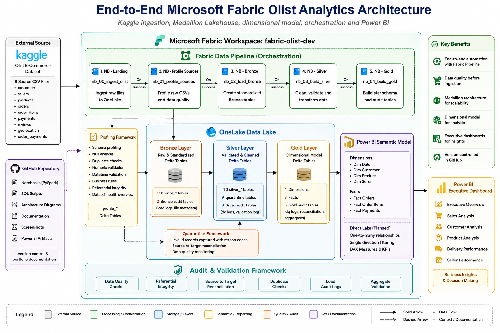
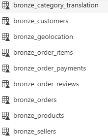
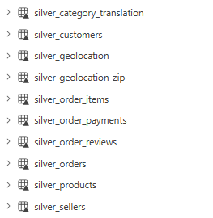
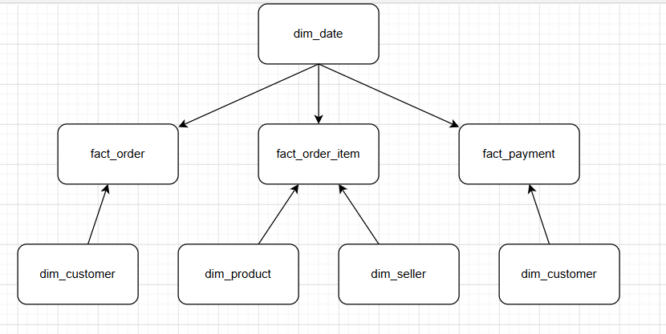
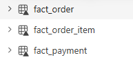
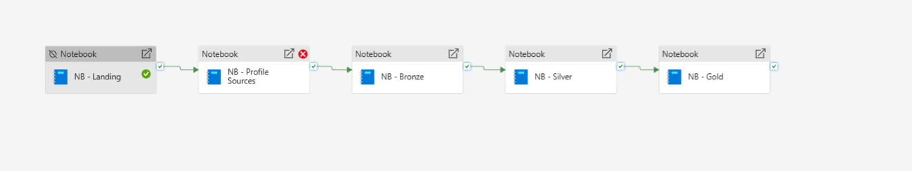

# Olist E-Commerce Analytics Platform using Microsoft Fabric

> End-to-end Microsoft Fabric data engineering and analytics project

> implementing source ingestion, persistent data profiling, Medallion

> Architecture, dimensional modeling, pipeline orchestration, semantic

> modeling, and a five-page Power BI executive dashboard.


## 📊 Power BI Dashboard Showcase

The final report contains five analytical pages covering executive performance, revenue, customers, operations, payments, and customer reviews.

### 1. Executive Overview


### 2. Sales & Revenue


### 3. Customer Intelligence


### 4. Operations & Logistics


### 5. Payments & Reviews


> The dashboard is backed by the Fabric Lakehouse, Gold dimensional model, semantic model, centralized DAX measures, and orchestrated Medallion pipeline documented below.

---

## 🏗️ End-to-End Architecture



## Project Overview

This project builds a complete analytics platform on the public **Olist
Brazilian E-Commerce** dataset using Microsoft Fabric.

The solution demonstrates the full analytical lifecycle:

``` text
Kaggle / Source CSVs
        ↓
Landing in OneLake
        ↓
Source Profiling & Data Quality
        ↓
Bronze Delta Layer
        ↓
Silver Validation + Quarantine
        ↓
Gold Dimensional Model
        ↓
Power BI Semantic Model
        ↓
Five-Page Executive Dashboard
```

The implementation emphasizes production-style engineering practices
including data-quality controls, audit logging, source-to-target
reconciliation, quarantine handling, explicit analytical grains,
dimensional modeling, and orchestrated execution.

------------------------------------------------------------------------

## Key Project Highlights

-   End-to-end implementation in **Microsoft Fabric**
-   **9 Olist source CSVs** ingested into OneLake
-   Persistent source-profiling framework
-   Bronze → Silver → Gold **Medallion Architecture**
-   Delta Lake managed tables
-   Quarantine framework for invalid Silver records
-   Bronze, Silver, and Gold audit controls
-   Source-to-target and financial reconciliation
-   Gold model with **4 dimensions + 3 facts**
-   Grain-safe separation of orders, order items, and payments
-   Fabric Data Pipeline orchestration
-   Centralized Power BI `_Measures` library
-   Time-intelligence measures
-   Five-page executive Power BI report
-   Architecture, technical documentation, screenshots, and portfolio
    evidence maintained in GitHub

------------------------------------------------------------------------

## Tech Stack

| Area                      | Technology                |
|-------------------------- | ------------------------- |
| Cloud Analytics Platform  | Microsoft Fabric          |
| Storage                   | OneLake                   |
| Data Platform             | Fabric Lakehouse          |
| Processing                | Apache Spark / PySpark    |
| Table Format              | Delta Lake                |
| Query / Serving           | SQL Analytics Endpoint    |
| Orchestration             | Fabric Data Pipeline      |
| Semantic Layer            | Power BI Semantic Model   |
| Visualization             | Power BI                  |
| Version Control           | Git / GitHub              |
| Development               | VS Code                   |

------------------------------------------------------------------------

## End-to-End Architecture

The solution is organized around a Medallion Architecture with dedicated
quality, audit, orchestration, semantic, and reporting components.


### Processing Flow

``` text
External Olist Dataset
        │
        ▼
Landing / OneLake Files
        │
        ├──────────────► Source Profiling
        │
        ▼
Bronze
Raw + Standardized Delta Tables
        │
        ▼
Silver
Validated + Cleaned Delta Tables
        │
        ├──────────────► Quarantine Framework
        │
        ▼
Gold
Dimensional Delta Model
        │
        ▼
Power BI Semantic Model
        │
        ▼
Executive Analytics Dashboard
```

------------------------------------------------------------------------

## Repository Structure

``` text
fabric-olist-ecommerce-analytics/
│
├── architecture/
│   ├── images/
│   ├── end_to_end_architecture.drawio
│   ├── solution_architecture.drawio
│   ├── star_schema.drawio
│   └── README.md
│
├── dashboard/
│   ├── Icon Set/
│   ├── Complete_Dashboard_Planning_Matrix.xlsx
│   ├── rpt_olist_ecommerce_analytics.pbix
│   └── README.md
│
├── data/
│   └── README.md
│
├── demo/
│   └── README.md
│
├── docs/
│   ├── 01_project_charter.md
│   ├── 02_fabric_setup.md
│   ├── 03_data_ingestion.md
│   ├── 04_source_profiling.md
│   ├── 05_bronze_layer.md
│   ├── 06_silver_layer.md
│   ├── 07_gold_layer.md
│   ├── 08_pipeline.md
│   ├── 09_semantic_model.md
│   ├── 10_dashboard.md
│   ├── transformation_specification.xlsx
│   └── README.md
│
├── notebooks/
│   ├── nb_00_ingest_olist.ipynb
│   ├── nb_01_profile_sources.ipynb
│   ├── nb_02_load_bronze.ipynb
│   ├── nb_03_build_silver.ipynb
│   ├── nb_04_build_gold.ipynb
│   └── README.md
│
├── pipelines/
│   ├── pipeline_design.md
│   ├── pipeline_execution_flow.png
│   └── README.md
│
├── screenshots/
│   ├── 02-fabric-setup/
│   ├── 03-data-ingestion/
│   ├── 04-source-profiling/
│   ├── 05-bronze-layer/
│   ├── 06-silver-layer/
│   ├── 07-gold-layer/
│   ├── 08-pipeline/
│   ├── 09-semantic-model/
│   ├── 10-dashboard/
│   └── README.md
│
├── .gitignore
├── LICENSE
└── README.md
```

------------------------------------------------------------------------

# Data Engineering Implementation

## 1. Landing & Ingestion

The ingestion notebook lands the Olist source CSV files in the Fabric
Lakehouse / OneLake environment.

Key characteristics:

-   source-faithful landing;
-   validation of the expected source files;
-   no business transformations at ingestion;
-   separation of landing from downstream Medallion processing.


Detailed documentation: [Data Ingestion](docs/03_data_ingestion.md)

------------------------------------------------------------------------

## 2. Source Profiling & Data Quality

Before Bronze/Silver transformation, the source datasets pass through a
dedicated profiling framework.

The framework covers:

-   table-level profiling;
-   column-level profiling;
-   null analysis;
-   duplicate analysis;
-   key-quality analysis;
-   numeric profiling;
-   datetime profiling;
-   categorical profiling;
-   business-rule validation;
-   referential-integrity profiling;
-   dataset-health overview;
-   profiling run history.


Detailed documentation: [Source Profiling](docs/04_source_profiling.md)

------------------------------------------------------------------------

## 3. Bronze Layer

The Bronze layer converts landed source files into source-aligned
managed Delta tables.

### Engineering Features

-   metadata-driven loading;
-   source-faithful values;
-   technical ingestion metadata;
-   record-level hashing;
-   audit logging;
-   source-to-target reconciliation;
-   repeatable overwrite-based development loads.

### Bronze Business Tables

``` text
bronze_customers
bronze_orders
bronze_order_items
bronze_products
bronze_sellers
bronze_order_reviews
bronze_order_payments
bronze_geolocation
bronze_category_translation
```

### Bronze Audit Tables

``` text
audit_bronze_load
audit_bronze_run_history
```



Detailed documentation: [Bronze Layer](docs/05_bronze_layer.md)

------------------------------------------------------------------------

## 4. Silver Layer

The Silver layer transforms Bronze data into validated, typed, enriched,
and analysis-ready business entities.

### Implemented Features

-   explicit data-type conversion;
-   standardization and normalization;
-   duplicate handling;
-   business-rule validation;
-   quarantine framework;
-   derived order and delivery features;
-   product-category enrichment;
-   geolocation aggregation;
-   referential-integrity validation;
-   audit logging;
-   source-to-target reconciliation.

### Silver Outputs

``` text
10 silver_* tables
9 quarantine tables
3 Silver audit tables
```



Detailed documentation: [Silver Layer](docs/06_silver_layer.md)

------------------------------------------------------------------------

## 5. Gold Dimensional Model

The Gold layer reorganizes validated Silver entities into a
business-ready dimensional model.

### Dimensions

``` text
dim_date
dim_customer
dim_product
dim_seller
```

### Facts

``` text
fact_order
fact_order_item
fact_payment
```

Each fact retains an explicit analytical grain. Order-item and payment
facts remain separate so that joining two one-to-many datasets does not
inflate revenue, freight, or payment measures.





### Gold Validation

The implementation validates:

-   natural-key uniqueness;
-   surrogate-key uniqueness;
-   fact-table grains;
-   fact-to-dimension relationships;
-   Silver-to-Gold row counts;
-   GMV reconciliation;
-   freight reconciliation;
-   payment reconciliation.

Detailed documentation: [Gold Layer](docs/07_gold_layer.md)

------------------------------------------------------------------------

# Fabric Pipeline Orchestration

The five engineering notebooks are orchestrated through Microsoft Fabric
Data Pipeline.

``` text
NB - Landing
      ↓
NB - Profile Sources
      ↓
NB - Bronze
      ↓
NB - Silver
      ↓
NB - Gold
```



Activities are connected using **On Success** dependencies so downstream
layers execute only after their required upstream stage completes
successfully.

Detailed documentation: [Pipeline](docs/08_pipeline.md)

------------------------------------------------------------------------

# Semantic Model

The reporting layer uses the Gold dimensional model as the foundation
for the Power BI semantic model.

The semantic model contains:

-   dimensional relationships;
-   single-direction filtering;
-   centralized `_Measures` table;
-   business-friendly measure formatting;
-   KPI logic;
-   time-intelligence calculations.


## Measure Organization

``` text
_Measures
├── Customers
├── Delivery
├── Orders
├── Payments
├── Products
├── Revenue
├── Reviews
├── sellers
└── Time Intelligence
```

Measure groups include revenue, orders, customers, products, sellers,
delivery, payments, reviews, and YoY/YTD time intelligence.

Detailed documentation: [Semantic Model](docs/09_semantic_model.md)

------------------------------------------------------------------------

# Power BI Dashboard

The finished Power BI report is showcased at the top of this README. The five pages are designed for different analytical questions:

| Page | Analytical Focus |
|---|---|
| **Executive Overview** | GMV, orders, customers, AOV, delivery performance, geography, product categories, and payment mix |
| **Sales & Revenue** | Revenue trends, states, sellers, categories, product metrics, and Pareto concentration |
| **Customer Intelligence** | Active/new/repeat customers, order frequency, customer value, geography, and growth |
| **Operations & Logistics** | Delivery reliability, delays, delivery time, freight behavior, and operational performance |
| **Payments & Reviews** | Payment methods, installments, review distribution, customer satisfaction, and satisfaction trends |

Detailed documentation: [Dashboard Documentation](docs/10_dashboard.md)

Dashboard artifacts: [`dashboard/`](dashboard/)

---

# Dashboard KPI Coverage

The final report includes business measures across several domains.

| Domain            | Example KPIs                                                                         |
| ----------------- | ------------------------------------------------------------------------------------ |
| Revenue           | Total GMV, Average Order Value, GMV YoY %                                            |
| Orders            | Total Orders, Delivery Rate, Cancellation Rate                                       |
| Customers         | Active Customers, Repeat Customers, Repeat Customer Rate, New Customers              |
| Products          | Active Products, Item GMV, Items Sold, Average Item Price                            |
| Sellers           | Active Sellers, Seller GMV, Average GMV per Seller                                   |
| Delivery          | On-Time Delivery Rate, Late Delivery Rate, Average Delivery Days, Average Delay Days |
| Payments          | Payment Fact Value, Payment Transactions, Average Installments                       |
| Reviews           | Average Review Score, High Rating Rate, Low Rating Rate                              |
| Time Intelligence | GMV YoY, Orders YoY, GMV YTD, Orders YTD                                             |

# Data Quality & Audit Framework

Data quality is implemented throughout the solution rather than treated
as a single downstream check.

``` text
Source Profiling
      ↓
Bronze Reconciliation
      ↓
Silver Validation + Quarantine
      ↓
Silver Relationship Audits
      ↓
Gold Grain Validation
      ↓
Gold Relationship Audits
      ↓
Financial Reconciliation
```

This provides evidence for:

-   source health;
-   transformation completeness;
-   invalid-record handling;
-   relationship integrity;
-   row-count reconciliation;
-   financial reconciliation;
-   execution history.

------------------------------------------------------------------------

# Documentation

The `docs/` folder contains the complete technical implementation
narrative.

| Document                                                | Purpose                                                      |
| -----------------------------------------------------   | ------------------------------------------------------------ |
| [`01_project_charter.md`](docs/01_project_charter.md)   | Project scope, objectives,stakeholders, and success criteria |
| [`02_fabric_setup.md`](docs/02_fabric_setup.md)         | Fabric workspace and Lakehouse setup                         |
| [`03_data_ingestion.md`](docs/03_data_ingestion.md)     | Source ingestion and OneLake landing                         |
| [`04_source_profiling.md`](docs/04_source_profiling.md) | Profiling and source-quality framework                       |
| [`05_bronze_layer.md`](docs/05_bronze_layer.md)         | Bronze architecture and audit implementation                 |
| [`06_silver_layer.md`](docs/06_silver_layer.md)         | Silver transformations, quarantine, and quality controls     |
| [`07_gold_layer.md`](docs/07_gold_layer.md)             | Dimensional modeling and Gold validation                     |
| [`08_pipeline.md`](docs/08_pipeline.md)                 | Fabric orchestration                                         |
| [`09_semantic_model.md`](docs/09_semantic_model.md)     | Semantic model, relationships, and measures                  |
| [`10_dashboard.md`](docs/10_dashboard.md)               | Final five-page Power BI report                              |

Additional project documentation is available in the `architecture/`,
`data/`, `dashboard/`, `notebooks/`, `pipelines/`, and `screenshots/`
folders.

------------------------------------------------------------------------

# Project Status

|  Phase                       | Status          |
|  --------------------------- | --------------  |
|  Project Planning            | ✅ Complete    |
|  Repository Setup            | ✅ Complete    |
|  Architecture Design         | ✅ Complete    |
|  Fabric Environment          | ✅ Complete    |
|  Landing / Data Ingestion    | ✅ Complete    |
|  Source Profiling            | ✅ Complete    |
|  Bronze Layer                | ✅ Complete    |
|  Silver Layer                | ✅ Complete    |
|  Gold Layer                  | ✅ Complete    |
|  Data Quality / Quarantine   | ✅ Complete    |
|  Audit & Reconciliation      | ✅ Complete    |
|  Fabric Pipeline             | ✅ Complete    |
|  Semantic Model              | ✅ Complete    |
|  Power BI Dashboard          | ✅ Complete    |
|  Technical Documentation     | ✅ Complete    |
|  Final GitHub Packaging      | ✅ Complete    |

------------------------------------------------------------------------

# Dataset

The project uses the public **Olist Brazilian E-Commerce Dataset**
hosted on Kaggle.

The repository intentionally does not duplicate the complete raw
dataset. Source-data structure and usage are documented in
[`data/README.md`](data/README.md).

------------------------------------------------------------------------

# Portfolio Value

This project demonstrates practical experience across the complete
analytics engineering lifecycle:

-   cloud data ingestion;
-   OneLake / Lakehouse architecture;
-   Spark and PySpark transformation;
-   Delta Lake;
-   data profiling and quality engineering;
-   quarantine design;
-   audit and reconciliation frameworks;
-   dimensional modeling;
-   pipeline orchestration;
-   semantic modeling;
-   DAX measures and time intelligence;
-   Power BI dashboard design;
-   technical documentation;
-   Git-based project organization.

------------------------------------------------------------------------

# Author

**Rahul Ratusaria**

Senior Data Analyst

**Microsoft Fabric \| PySpark \| SQL \| Power BI \| Data Engineering**

------------------------------------------------------------------------

## Project Completion

The core analytics solution is complete.

The repository represents an end-to-end implementation from **external
source ingestion through executive Power BI reporting**, with technical
documentation and screenshot evidence retained for reproducibility and
portfolio review.
