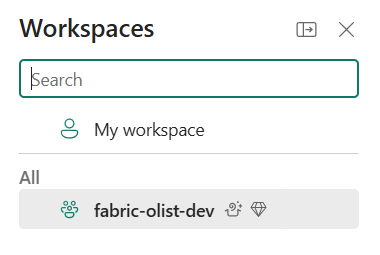
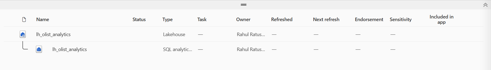
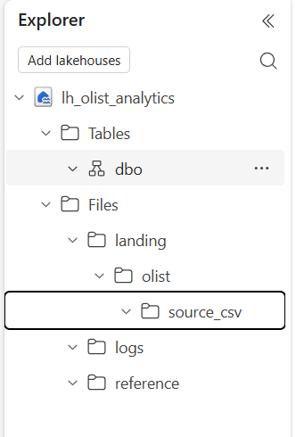

# Microsoft Fabric Environment Setup

## Workspace

- Workspace name: `fabric-olist-dev`
- Capacity: Microsoft Fabric Trial
- Purpose: Development workspace for the Olist e-commerce analytics project



## Lakehouse

- Lakehouse name: `lh_olist_analytics`



## Initial OneLake Folder Structure

```text
Files/
├── landing/
│   └── olist/
│       └── source_csv/
├── reference/
└── logs/
```


