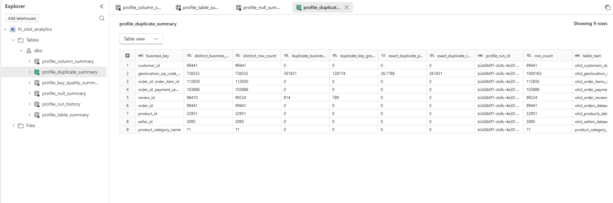
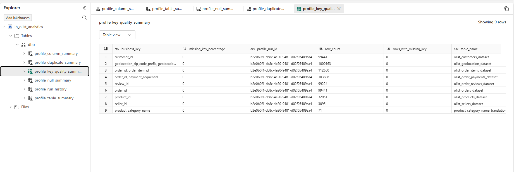
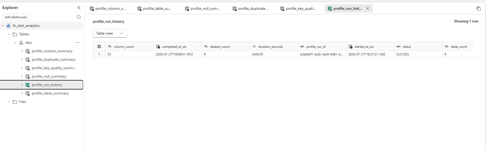
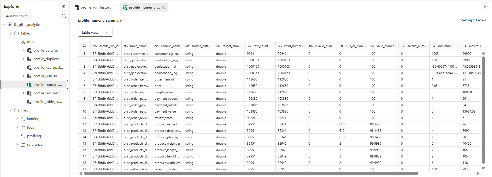
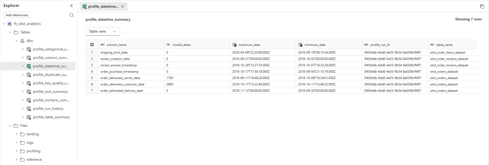
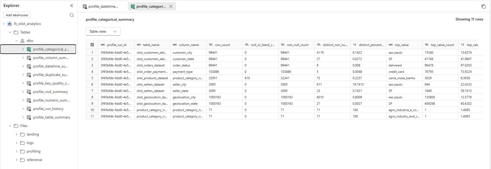
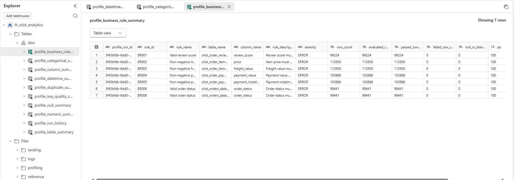
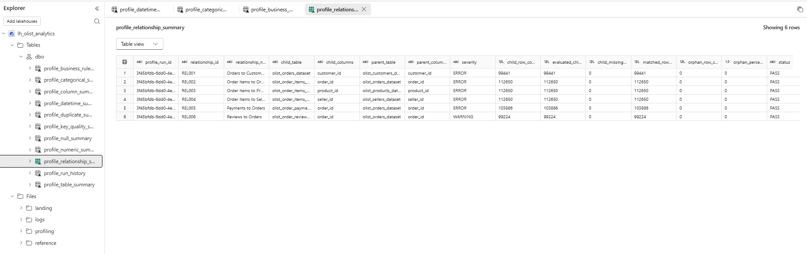
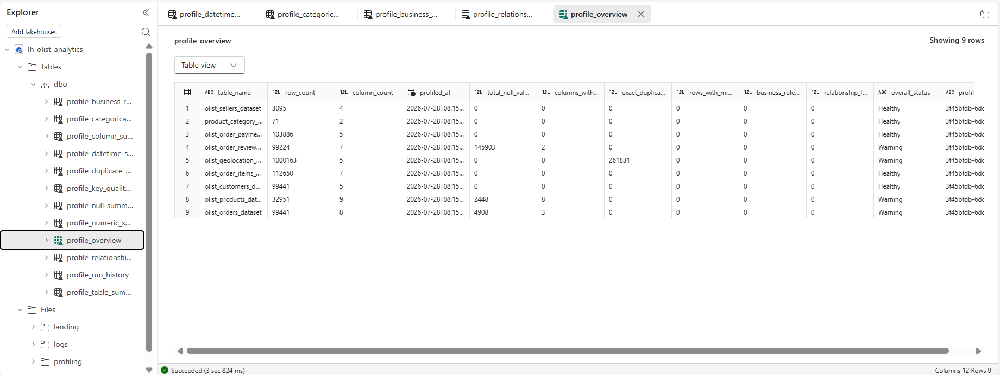

## Initial Profiling Results

The profiling notebook successfully loaded all nine Olist source datasets and generated:

- Table-Level Statistics
- column-Level Metadata
- Row Counts
- Column Counts
- Data Types
- Null Counts
- Distinct-Value Counts

The results are persisted as Delta tables:

- profile_table_summary
- profile_column_summary
- profile_null_summary
- profile_duplicate_summary
- profile_key_quality_summary
- profile_run_history
- profile_numeric_summary
- profile_datetime_summary
- profile_categorical_summary
- profile_business_rule_summary
- profile_relationship_summary

## Null Analysis

The profiling framework generated column-level null statistics for every source dataset.

Metrics collected:

- Null Count
- Null Percentage
- Non-Null Count
- Non-Null Percentage

## Duplicate Analysis

The framework evaluates two duplicate categories:

1. Exact duplicate rows
2. Duplicate expected business keys

Results are stored in:
- `profile_duplicate_summary`

Business keys were defined according to the expected grain of each source dataset.

The geolocation dataset was not treated as unique at ZIP-prefix level because multiple coordinate records can exist for the same prefix.

## Business-Key Completeness

Expected business-key columns were tested for null and blank values.

Results are stored in:

- `profile_key_quality_summary`

## Profiling Run History

Each profiling execution receives a unique run identifier and records:

- start timestamp;
- completion timestamp;
- duration;
- number of datasets;
- number of tables;
- number of columns;
- execution status.

Run metadata is stored in:

- `profile_run_history`

## Numeric Profiling

The framework automatically identifies numeric columns and computes:

- Minimum
- Maximum
- Mean
- Standard deviation

Results:

- `profile_numeric_summary`

## Datetime Profiling

The framework identifies timestamp columns and computes:

- Earliest timestamp
- Latest timestamp
- Invalid timestamp count

Results:

- `profile_datetime_summary`

## Categorical Profiling

The framework profiles all string columns by calculating:

- Distinct values
- Most frequent value
- Frequency of the most common value

Results:

- `profile_categorical_summary`

## Business-Rule Validation

The profiling framework validates source records against explicit business conditions.

Initial rules include:

- review score must be between 1 and 5;
- item price must be non-negative;
- freight value must be non-negative;
- payment value must be non-negative;
- payment instalments must be non-negative;
- order status must belong to the expected domain.

Results are stored in:

- `profile_business_rule_summary`

Missing values are reported separately from business-rule failures.

## Referential-Integrity Profiling

The profiling framework validates expected relationships between source datasets.

Relationships tested:

- orders to customers;
- order items to orders;
- order items to products;
- order items to sellers;
- payments to orders;
- reviews to orders.

The framework records:

- total child rows;
- rows eligible for relationship evaluation;
- child rows with missing keys;
- matched rows;
- orphan rows;
- orphan percentage;
- relationship status.

A Spark left anti join is used to identify child records that do not have a matching parent key.

Results are stored in:

- `profile_relationship_summary`

Missing child keys are reported separately from orphan keys.

## Dataset Health Overview

A consolidated profiling dataset combines all profiling metrics into a single executive summary.

Metrics include:

- Row count
- Column count
- Null analysis
- Duplicate analysis
- Missing business keys
- Business-rule failures
- Relationship failures
- Overall dataset health

Results are stored in:

profile_overview

This table serves as the primary data source for the Data Quality dashboard.

