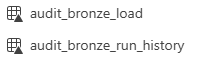
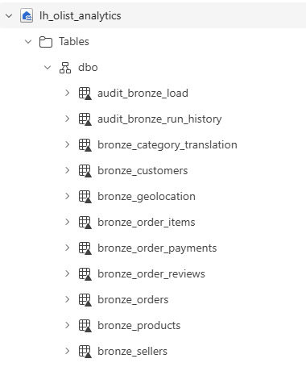
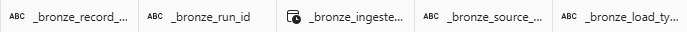

# Bronze Layer

## Objective

Load the raw Olist source files into managed Delta tables while preserving source fidelity and adding technical lineage metadata.

## Inputs

Raw CSV files stored under:

```text
Files/landing/olist/source_csv/
```

## Outputs

The Bronze layer contains:

- `bronze_customers`
- `bronze_geolocation`
- `bronze_order_items`
- `bronze_order_payments`
- `bronze_order_reviews`
- `bronze_orders`
- `bronze_products`
- `bronze_sellers`
- `bronze_category_translation`

Audit tables:

- `audit_bronze_load`
- `audit_bronze_run_history`

## Design Principles

The Bronze layer:

- preserves source column names;
- preserves source values as strings;
- performs no cleansing;
- performs no deduplication;
- performs no business filtering;
- adds technical lineage columns;
- converts the source into Delta format.

## Technical Metadata

Every Bronze table includes:

- `_bronze_record_hash`
- `_bronze_run_id`
- `_bronze_ingested_at`
- `_bronze_source_file`
- `_bronze_load_type`

## Record Hash

A SHA-256 hash is generated from the original source columns.

Null values are represented using an explicit `<NULL>` marker before hashing.

Metadata columns are excluded from the hash so the same source record produces the same hash across reruns.

## Load strategy

The current Olist source is static.

Therefore, Bronze tables use a full overwrite strategy during development.

A production source would generally use an append or merge-based incremental strategy with watermarks and idempotency controls.

## Schema strategy

All source fields remain strings in Bronze.

Numeric and timestamp conversion is intentionally deferred to the silver layer.

## Partition strategy

Bronze tables are not partitioned because the source tables are relatively small.

Partitioning would create unnecessary small-file and metadata overhead.

## Reconciliation

Every source files is compared with its target Delta table.

The load fails when source and target row counts do not match.

Results are stored in:

- `audit_bronze_load`

## Evidence

### Bronze tables


### Load Audit



### Bronze Schema



### Lineage Metadata



## Result

All nine source files were loaded into managed Bronze Delta tables with complete source-to-target row-count reconciliation.