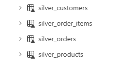
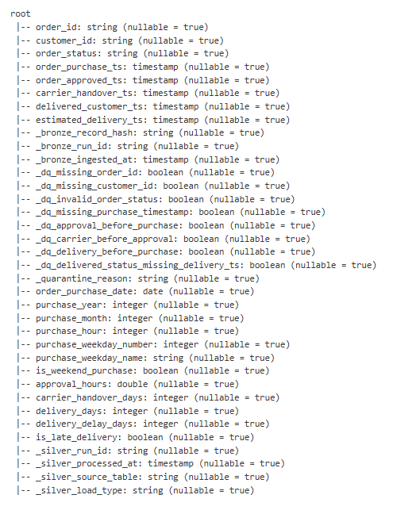
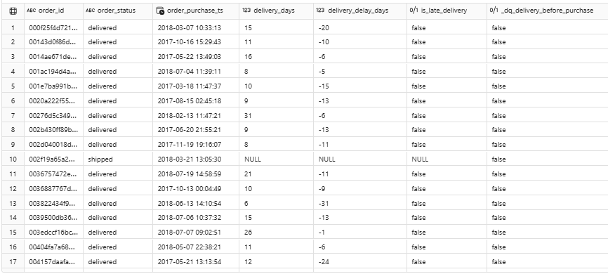
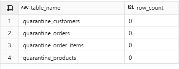
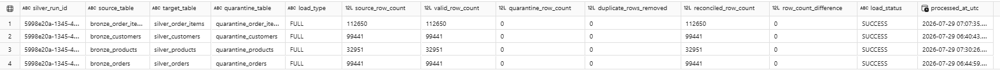

## Core Silver Tables

The first Silver implementation transforms:

- `bronze_customers` into `silver_customers`;
- `bronze_orders` into `silver_orders`;
- `bronze_order_items` into `silver_order_items`;
- `bronze_products` into `silver_products`.

## Transformation Operations

Core operations include:

- trimming source strings;
- converting blank strings to null;
- correcting selected source column names;
- converting numeric and timestamp values;
- enforcing expected business keys;
- deterministic business-key deduplication;
- generating row-level quality flags;
- separating critical invalid records into quarantine tables;
- reconciling source, valid, quarantined and duplicate counts.

## Data Types

Examples include:

- order timestamps converted to timestamp;
- order-item sequence converted to integer;
- price and freight converted to `decimal(18,2)`;
- product dimensions converted to numeric fields;
- ZIP prefixes converted to integer.

## Quarantine Strategy

Critical failures are written to:

- `quarantine_customers`;
- `quarantine_orders`;
- `quarantine_order_items`;
- `quarantine_products`.

Non-critical anomalies remain in Silver with explicit `_dq_*` flags.

## Derived Features

The core Silver tables include row-level operational features such as:

- purchase date, year, month, weekday and hour;
- approval duration;
- delivery duration;
- delivery delay;
- late-delivery flag;
- order-item total value;
- freight-to-price ratio;
- product volume;
- product density.

These are row-level enrichments. Business aggregations and dashboard KPIs remain part of the Gold and semantic-model layers.

## Audit

Each Silver load records:

- Bronze source row count;
- valid Silver row count;
- quarantine row count;
- duplicate rows removed;
- reconciliation difference;
- execution status.

Results are stored in:

- `audit_silver_load`

## Core Silver Evidence

