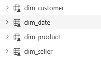
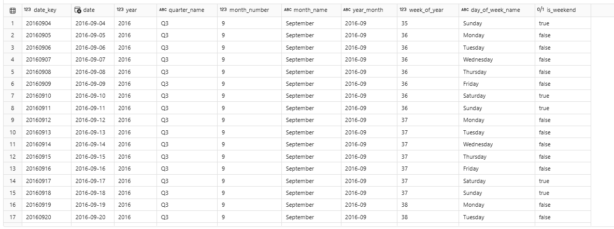
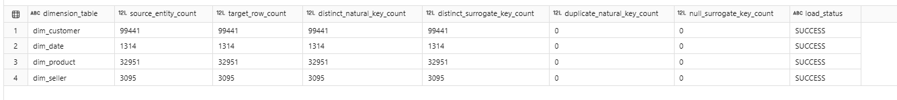

# Gold Layer

## Purpose

Transform standardized silver entities into a business-ready model for
SQL analytics and Power BI.

## Inputs

-   `silver_customers`
-   `silver_orders`
-   `silver_order_items`
-   `silver_products`
-   `silver_sellers`
-   `silver_order_payments`
-   `silver_order_reviews`
-   `silver_geolocation_zip`

## Outputs

### Dimensions

-   `dim_date`
-   `dim_customer`
-   `dim_product`
-   `dim_seller`

### Facts

-   `fact_order`
-   `fact_order_item`
-   `fact_payment`

## Design Pattern

The gold layer follows a star-schema design.

Dimension table provides descriptive attributes for filtering and
grouping.

Fact tables retain measurable business events at explicitly documented
grains.

## Table Grains

  Table               Grain
  ------------------- ----------------------------------------
  `dim_date`          One row per calendar date
  `dim_customer`      One row per customer ID
  `dim_product`       One row per product ID
  `dim_seller`        One row per seller ID
  `fact_order`        One row per order
  `fact_order_item`   One row per order and item sequence
  `fact_payment`      One row per order and payment sequence

## Key Design Decisions

-   separate facts prevent item-payment multiplication.
-   dimensions use deterministic integer surrogate keys.
-   purchase date is the primary reporting-customer analysis.
-   `customer_unique_id` is retained for repeat-customer analysis.
-   monetary fields remain in Brazilian real.
-   GMV is not interpreted as profit.
-   required filter attributes are materialized in the gold dimension.

## Implemented Dimensions

The completed Gold implementation contains:

-   `dim_date`;
-   `dim_customer`;
-   `dim_product`;
-   `dim_seller`.

## Date Dimension

`dim_date` contains one row per calendar date across the full analytical
date range found in the Silver tables.

Attributes include:

-   year;
-   quarter;
-   month;
-   week;
-   day;
-   weekday;
-   weekend flag;
-   year-month sorting fields.

The integer `date_key` uses the `YYYYMMDD` format.

## Customer Dimension

`dim_customer` contains one row per `customer_id`.

It retains `customer_unique_id` for persistent-customer analysis.

Enrichments include:

-   first order date;
-   last order date;
-   lifetime distinct order count;
-   new/repeat classification;
-   ZIP-level coordinates.

## Product Dimension

`dim_product` contains one row per product.

It includes:

-   Portuguese category;
-   English category;
-   translation status;
-   descriptive text-length attributes;
-   photo count;
-   weight;
-   dimensions;
-   volume;
-   density.

## Seller Dimension

`dim_seller` contains one row per seller and includes seller geography
and ZIP-level coordinates.

## Surrogate Keys

Integer surrogate keys are generated deterministically by ordering the
natural key and assigning `row_number()`.

This approach is suitable for the static portfolio dataset.

A production incremental solution would use a persistent key-mapping
strategy, identity key or merge process.

## Dimension Validation

Every dimension is tested for:

-   expected row count;
-   natural-key uniqueness;
-   surrogate-key uniqueness;
-   null surrogate keys.

Results are stored in:

-   `audit_gold_dimension_load`

## Evidence








## Implemented Facts

The completed Gold layer includes:

-   `fact_order`;
-   `fact_order_item`;
-   `fact_payment`.

## Order Fact

`fact_order` contains one row per order.

It combines independently aggregated item, payment and review
information with order lifecycle attributes.

Measures include:

-   order GMV;
-   freight value;
-   total order value;
-   item count;
-   distinct product and seller counts;
-   payment value;
-   payment-record count;
-   review count;
-   average and latest review score;
-   delivery and delay measures.

## Order-Item Fact

`fact_order_item` contains one row per:

``` text
order_id + order_item_id
```

It includes:

-   customer key;
-   product key;
-   seller key;
-   order-date key;
-   item price;
-   freight value;
-   item total value;
-   freight-to-price ratio.

### Payment Fact

`fact_payment` contains one row per:

order_id + payment_sequence

It contains payment method, instalment behaviour and payment value.

### Fact Separation

Order items and payment records remain in separate fact tables.

A direct item-payment join could multiply records when an order has
multiple items and multiple payment rows.

Keeping separate grains protects GMV, freight and payment measures from
double counting.

### Gold Relationship Validation

All fact-to-dimension relationships are tested using surrogate keys.

The framework validates:

-   order-to-customer;
-   order-to-date;
-   item-to-customer;
-   item-to-product;
-   item-to-seller;
-   item-to-date;
-   payment-to-customer;
-   payment-to-date.

Results are stored in:

-   `audit_gold_relationship`.

### Financial Reconciliation

The Gold framework reconciles:

-   Silver item GMV to Gold item GMV;
-   Silver freight to Gold freight;
-   Silver payments to Gold payments;
-   item-fact GMV to order-fact GMV;
-   payment-fact totals to order-fact payment totals.

Results are stored in:

-   `audit_gold_reconciliation`.

### Gold Audit Tables

Operational metadata is stored in:

-   audit_gold_dimension_load;
-   audit_gold_fact_load;
-   audit_gold_relationship;
-   audit_gold_reconciliation;
-   audit_gold_run_history.

### Evidence

### Result

The completed Gold layer provides a validated star schema consisting of
four dimensions and three fact tables.

The tables are ready for the Microsoft Fabric Power BI semantic model.
