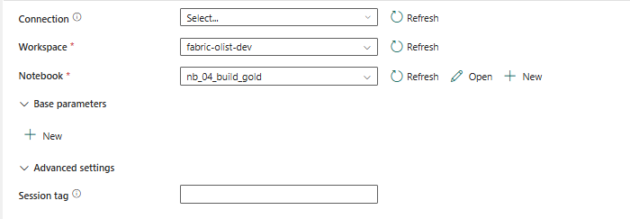

# Microsoft Fabric Pipeline

## Objective

Automate execution of the complete analytics platform.

The pipeline replaces manual notebook execution.

The pipeline currently orchestrates five notebook activities.

Pipeline Flow

Landing

↓

Profiling

↓

Bronze

↓

Silver

↓

Gold

## Expected Benefits

- automation;
- dependency management;
- monitoring;
- scheduling;
- retry support;
- production readiness.

Notebook activities execute sequentially using Success dependencies.

The orchestration layer will later be extended with monitoring and scheduling.

## Evidence

