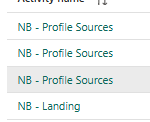

# Microsoft Fabric Pipeline

## Objective

Automate execution of the complete Olist analytics platform and replace
manual notebook execution with dependency-controlled orchestration.

## Pipeline Flow

``` text
Landing
   ↓
Profile Sources
   ↓
Bronze
   ↓
Silver
   ↓
Gold
```

The pipeline orchestrates five notebook activities sequentially using
**On Success** dependencies.

## Pipeline Configuration

  -----------------------------------------------------------------------
  Activity                            Purpose
  ----------------------------------- -----------------------------------
  Landing                             Load the raw Olist source files
                                      into OneLake

  Profile Sources                     Profile raw datasets and generate
                                      source-quality outputs

  Bronze                              Convert landed source data into
                                      standardized Bronze Delta tables

  Silver                              Clean, validate, enrich,
                                      quarantine, and reconcile data

  Gold                                Build the dimensional model and
                                      Gold audit framework
  -----------------------------------------------------------------------

## Execution Strategy

-   sequential notebook execution;
-   success-based dependencies;
-   shared Fabric workspace;
-   shared Lakehouse;
-   notebook-based processing;
-   layer-by-layer failure isolation.

## Why Sequential Execution

Each downstream layer depends on successful completion of the preceding
stage. The pipeline therefore prevents Gold processing from running
against an incomplete Silver layer, or Silver processing from running
against an incomplete Bronze layer.

## Benefits

-   repeatable end-to-end execution;
-   dependency management;
-   centralized run monitoring;
-   clear failure point identification;
-   reduced manual execution;
-   foundation for future scheduling/retry policies.

## Evidence




## Scope Note

The implemented portfolio solution demonstrates complete notebook
orchestration. Advanced production controls such as enterprise alerting,
environment promotion, and operational scheduling can be added as future
enhancements where required.

## Result

The Fabric Data Pipeline provides the orchestration layer connecting
ingestion, profiling, Bronze, Silver, and Gold processing into one
controlled workflow.
