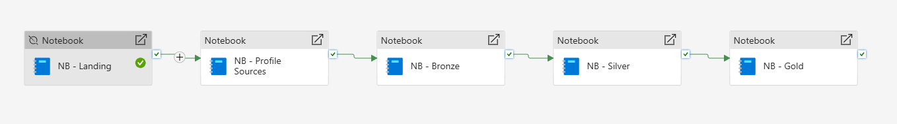

# Microsoft Fabric Pipeline Design

## Purpose

This document describes the orchestration design used to execute the
complete **Olist E-Commerce Analytics** data-engineering workflow in
Microsoft Fabric.

Instead of manually running individual notebooks, the Fabric Data
Pipeline coordinates all five stages using sequential **On Success**
dependencies.

## Implemented Execution Flow

``` text
Landing
   ↓
Profile Sources
   ↓
Bronze
   ↓
Silver
   ↓
Gold
```



The screenshot above reflects the implemented pipeline:

``` text
NB - Landing → NB - Profile Sources → NB - Bronze → NB - Silver → NB - Gold
```

## Activity Mapping

### 1. NB - Landing

**Notebook:** `nb_00_ingest_olist.ipynb`

Responsibilities:

-   access the external Olist dataset;
-   land the source CSV files in OneLake;
-   validate the expected source-file set;
-   prepare the landing zone for profiling and Bronze processing.

### 2. NB - Profile Sources

**Notebook:** `nb_01_profile_sources.ipynb`

Responsibilities:

-   profile all landed source datasets;
-   evaluate nulls, duplicates, keys, numeric values, datetimes, and
    categories;
-   run business-rule and referential-integrity profiling;
-   persist reusable `profile_*` quality outputs.

Profiling intentionally runs **before Bronze** so source-data quality is
measured before downstream transformation.

### 3. NB - Bronze

**Notebook:** `nb_02_load_bronze.ipynb`

Responsibilities:

-   read landed source CSV files;
-   create standardized Bronze Delta tables;
-   preserve source fidelity;
-   add ingestion and lineage metadata;
-   maintain Bronze load and run-history audits;
-   reconcile source and Bronze row counts.

### 4. NB - Silver

**Notebook:** `nb_03_build_silver.ipynb`

Responsibilities:

-   apply explicit data types;
-   normalize and clean source values;
-   validate business rules;
-   deduplicate where required;
-   enrich analytical entities;
-   quarantine invalid records with reason codes;
-   perform referential-integrity validation;
-   maintain Silver audit and reconciliation outputs.

### 5. NB - Gold

**Notebook:** `nb_04_build_gold.ipynb`

Responsibilities:

-   build `dim_date`;
-   build `dim_customer`;
-   build `dim_product`;
-   build `dim_seller`;
-   build `fact_order`;
-   build `fact_order_item`;
-   build `fact_payment`;
-   assign deterministic surrogate keys;
-   validate dimensional relationships;
-   perform financial and row-count reconciliation;
-   persist Gold audit outputs.

## Dependency Design

Each activity executes only after the preceding activity succeeds.

``` text
Landing
  └── On Success → Profile Sources
                       └── On Success → Bronze
                                          └── On Success → Silver
                                                             └── On Success → Gold
```

This design protects downstream layers from running against incomplete
upstream data.

## Retry Policy

The documented activity retry configuration is:

``` text
Retries: 2
Retry Interval: 30 seconds
```

Retries provide basic resilience for temporary execution failures while
preserving the dependency chain.

## Monitoring

Fabric Pipeline provides centralized visibility into:

-   activity execution state;
-   successful and failed runs;
-   notebook-level failure points;
-   pipeline run history;
-   activity duration and sequencing.

## Design Rationale

### Why Profile Before Bronze?

The project deliberately profiles the landed source files before Bronze
creation so that the quality of the original source can be measured
independently of downstream standardization.

### Why Sequential Execution?

The processing stages have explicit dependencies. Running them
sequentially ensures that each layer consumes a successfully completed
upstream state.

### Why Keep Notebooks Separate?

Separating ingestion, profiling, Bronze, Silver, and Gold processing
improves:

-   maintainability;
-   debugging;
-   auditability;
-   reusability;
-   layer ownership;
-   portfolio readability.

## Production Extension Opportunities

The implemented pipeline is complete for the project scope. In a
production deployment, the orchestration layer could additionally
include:

-   scheduled triggers;
-   environment-specific parameters;
-   alerting;
-   enterprise retry policies;
-   SLA monitoring;
-   notification workflows;
-   deployment pipelines and promotion controls.

These are enhancements rather than requirements for the completed
portfolio implementation.

## Final Result

The Fabric Data Pipeline provides a controlled orchestration layer for
the full processing chain:

**external source → landing → source profiling → Bronze → Silver → Gold
→ semantic/reporting layer**

The implemented activity order is:

**Landing → Profile Sources → Bronze → Silver → Gold**.
